# Bank Churn Data Analysis

## Background:
Churn prediction is important to improve customer satisfication and retention in the competative banking industry. Data analysis can help to discover useful information, draw conclusions and support decision-making toextract insights and inform strategies.

## Dataset Description:
This data set is highly imbalanced and contains details of a bank's customers and the target variable is a binary variable reflecting the fact whether the customer left the bank (closed the account) or continues to be a customer.
This dataset contains information of bank customers on RowNumber, CustomerId, Surname, CreditScore, Geography, Gender, Age, Tenure, Balance, NumOfProducts, HasCrCard, IsActiveMember, EstimatedSalary, Exited. The dataset comprises 10000 rows with 14 columns.

## Data Preparation
- Checking for missing values. There are missing values in Age and Credit Score. Using Iterative Imputer to replace missing values.
- Cheking for data duplication. There are 3 duplications which are dropped during the process.
- Standardize column names.

## Exploratory Data Analysis (EDA)
EDA helps to understand and identify patterns of the dataset through visualization.


```python
### Churn Distribution
The dataset has an imbalanced distribution with 2037 (over 10000 = 20.37%) exited customers.
```


    
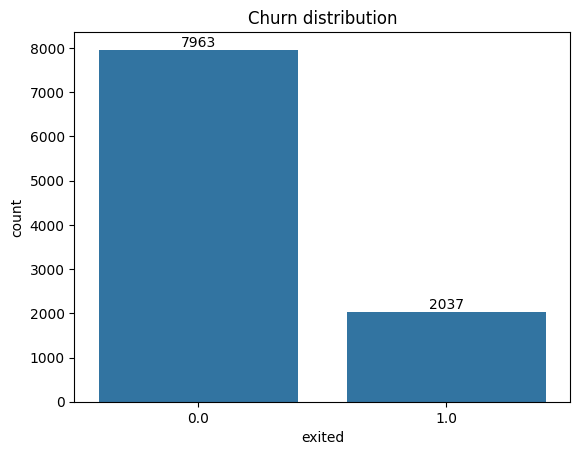
    


    


```python
### Age and Churn
Customers in the group of 40 - 60 age perform the highest rate comparing to other groups of age.

Middle-aged customers are a high high-risk group for churn. They may have changing financial needs that the bank is not meeting, or seek new financial products and better deals.

Recommendation: 
Design a loyalty program or specialized services for the 40-60 age group.
```


    
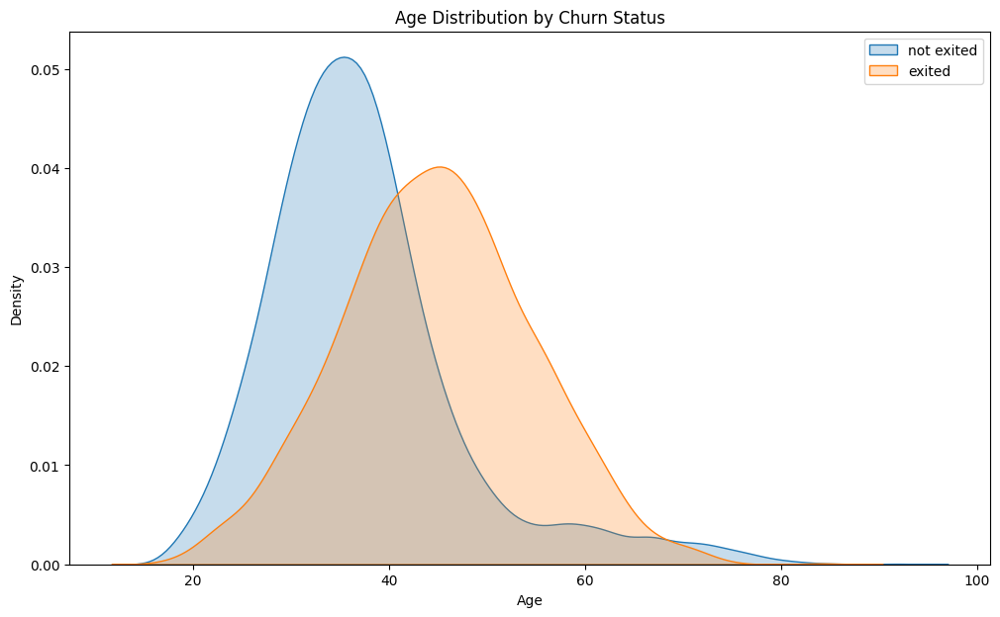
    


    


```python
### Gender and Churn
Female customers have the higher churning rate comparing to male customers.

The marketing and product strategies may appeal more to one group than the other.

Recommendation:
Review customer feedback and survey data to identify any specific reasones.
```


    
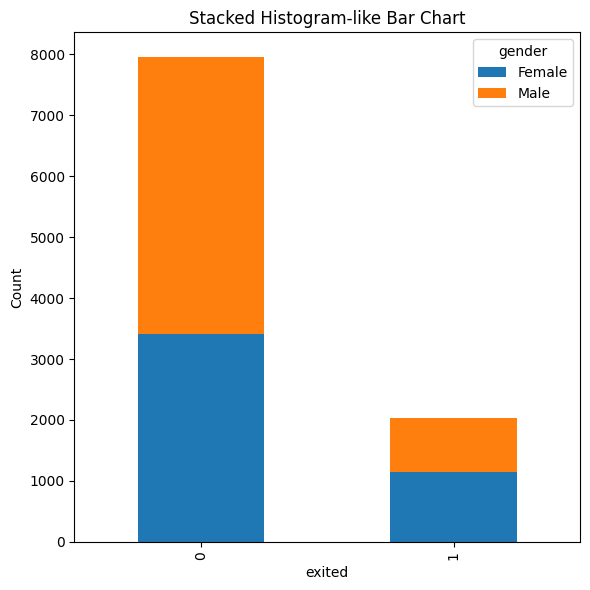
    


    


```python
### Geography and Churn
Germany demonstrates the highest churn rate, followed by Spain and France.

There are regional differences in customer churn. The bank is not effectively retaining customers in Germany.

Recommendation:
- Investigate the specific business practices in other countries that has lower churn rate. 
- Apply successful strategies in Germany to improve customer retention.
```


    
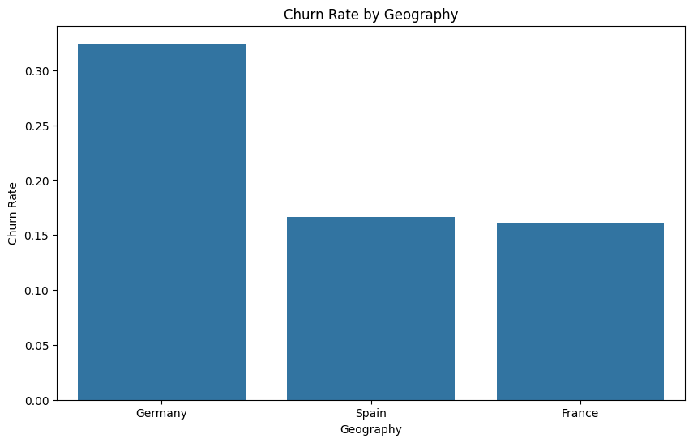
    


    


```python
### Active status and Churn
Inactive customers tend to churn more than the active customers.

Customer engagement is a critical factor in retention.

Recommendation:
- Develop a strategy to increase customer activity (promotinal offers for inactive members,...)
- Send personalized communication to inactive customer to re-engage them with services.
```


    
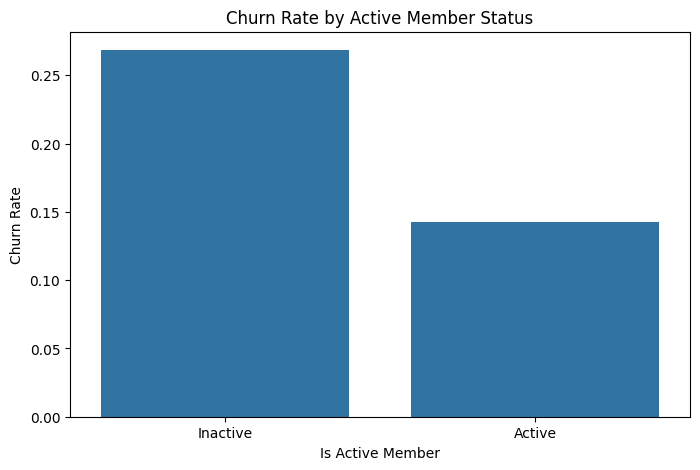
    


    


```python
### Credit Score and Churn
The stacked histogram shows the distribution of credit scores for both churned and non-churned customers. The two groups seem to be fairly evenly distributed across the credit score range, with no significant concentration of churners at either the high or low end. The overlap between the "stayed" and "exited" segments is extensive.

A customer's credit score is not a strong predictor of churn for this bank.                                                                                                                                                                                    
```


    
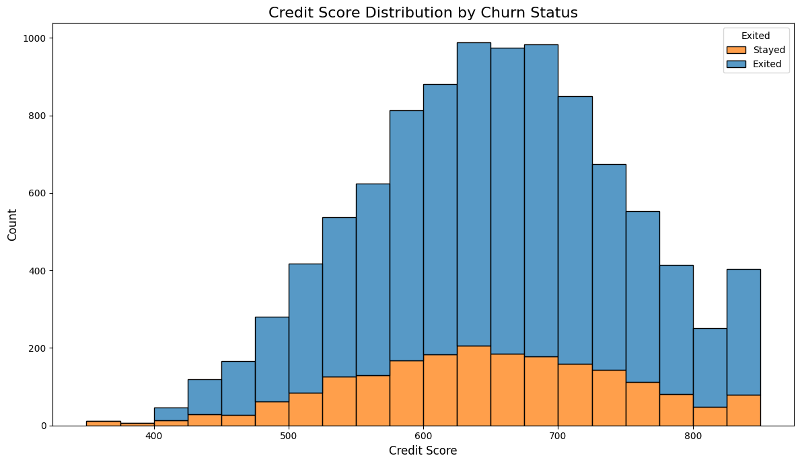
    


```python
### Tenure and Churn
The histogram shows that churn is relatively uniform across all years of Tenure. There isn't a significant drop-off at a specific point.

Churn is not tied to a specific loyalty milestone.
```


    
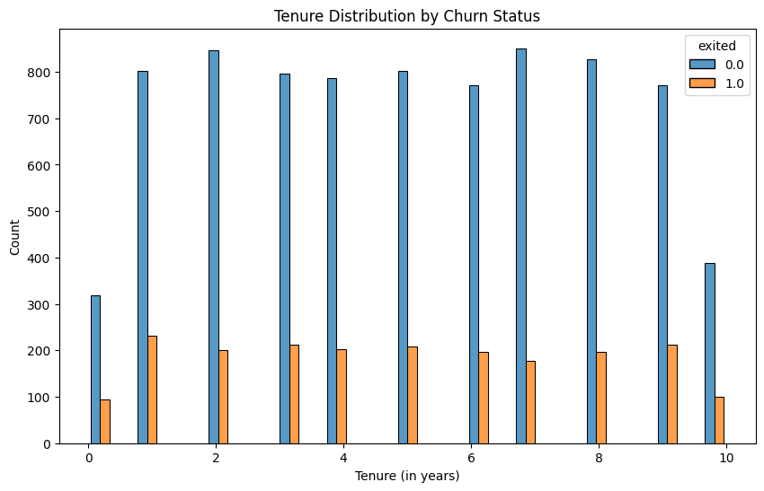
    


```python
### Balance and Churn
A large portion of churned customers had a significant account balance, while most non-churned customers had a balance of zero.

Customers with high balances are a major churn risk. These customers may be leaving to find better interest rates, lower fees, or different services at other banks.

Recommendation:
- Proactively engage high-balance customers with personalized offers (higher interest rates, exclusive services,...).
- Investigate why they are leaving, conduct surveys to understand and improve product offerings.
```


    
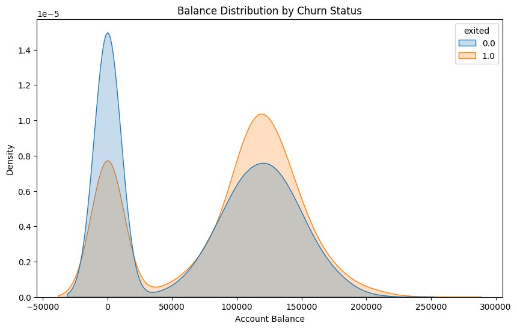
    


```python
### Number Of Products and Churn
The count plot shows that customers with NumOfProducts = 3 or 4 have a very high churn rate. While customers with 1 or 2 products form the majority of the customer base, a significant portion of churners come from the multi-product group.

Having more than 2 products is a major chun indicator.

Recommendation:
Review the customer experience for those with 3 or more products. Is the system difficult to manage? Is there higher fees?
```


    
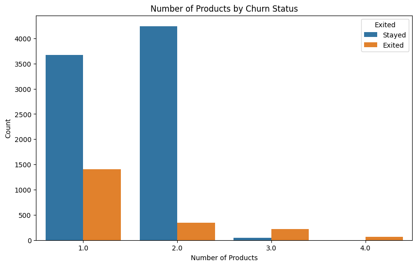
    


```python
### Have Credit Card and Churn 
The two pie charts illustrate the distribution of credit card ownership for customers who stayed and those who exited.
For customers who stayed, the majority (70.7%) have a credit card.
For customers who exited, a smaller majority (68.9%) have a credit card.

Having credit card is not a reliable indicator of churn risk.
```


    
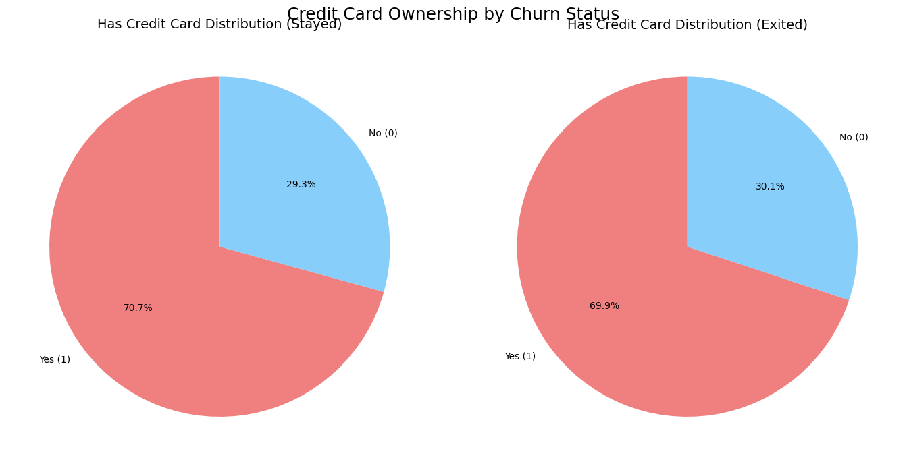
    


```python
### Estimated Salary and Churn
The box plot shows that the EstimatedSalary distribution is almost identical for both churned and non-churned customers. The median, quartiles, and overall range are very similar between the two groups.

A customer's estimated salery is not a useful predictor.
```


    
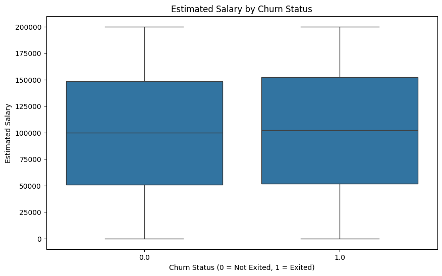
    


## Conclusion
The analysis above mentions some valuable insights from major factors that customer churn at the bank. Besides that, recommendations are also provided above which may help to improve the churn rate at this bank.
